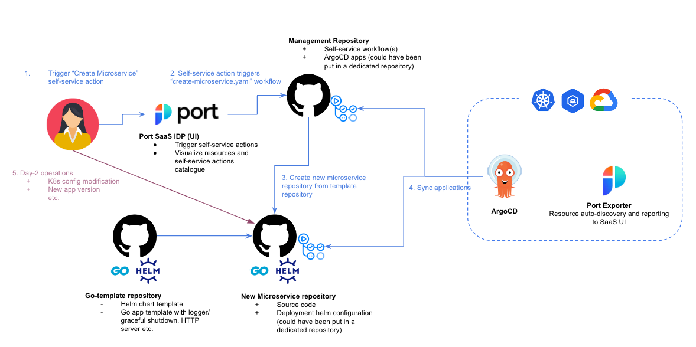
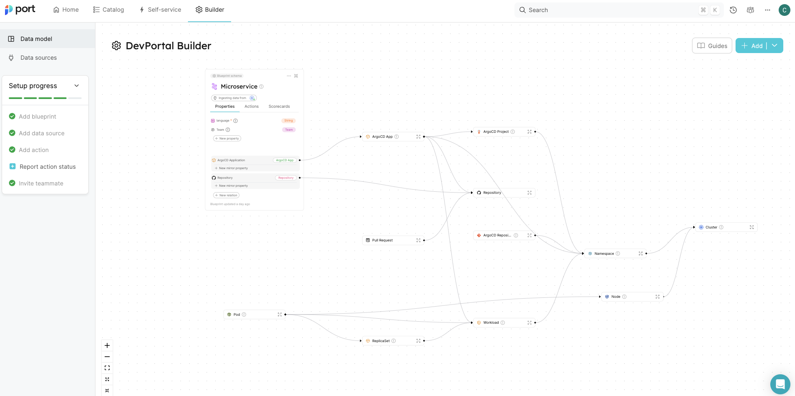
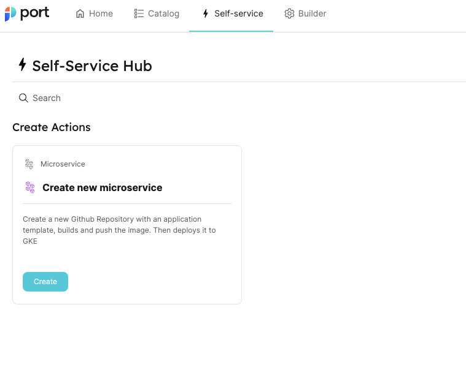
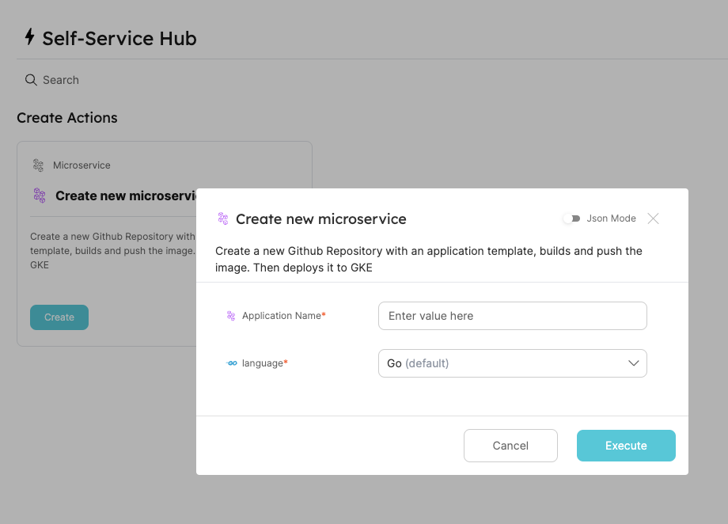
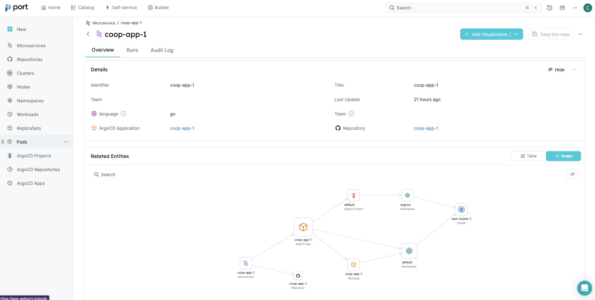

# Solution Architecture



Components:


+ **Port** ([getport.io](https://www.getport.io/)): 
    + Internal Developer Portal: 
        + Allows defining custom data models called `blueprints` (ex: a Microservice is a k8s deployment linked to a ArgoCD application, a github repository, other cloud resources etc.).
        + Displays information about the currently deployed resources (called `entities`) that are instances of blueprints
        + Provides access to a self-service actions catalogue to interact with these `entities`
        For example, let's define a (very simplistic) application model:

```json
            {
"identifier": "microservice",
"description": "Data model for microservice as defined at foo corp",
"title": "Microservice",
"icon": "Microservice",
"schema": {
    "properties": {
    "language": {
        "icon": "GPU",
        "title": "language",
        "description": "Language used to develop the app",
        "type": "string"
    },
    "team": {
        "title": "Team",
        "type": "string",
        "description": "app owner",
        "format": "team"
    }
    },
    "required": [
    "language"
    ]
},
"mirrorProperties": {},
"calculationProperties": {},
"relations": {
    "argocdapp": {
    "title": "ArgoCD Application",
    "target": "argocdApp",
    "required": false,
    "many": false
    },
    "repository": {
    "title": "Repository",
    "target": "repository",
    "required": false,
    "many": false
    }
}
}
```


When including transitive dependencies (an ArgoCD app or a Github Repo are themselves related to other resources such as an ArgoCD Project etc.), here is the complete data model we get in our example:


We define a self-service action on the `Microservice` entity to create a new microservice:


This self-service action basically triggers the `create-microservice.yaml` github workflow hosted in the management repository, providing as well input variables and the complete Port payload. 

When triggering this action, the developer is asked to provide the service's name and the programming language.


+ **Management Repo**:  ([link to repo](https://github.com/CCOLLOT/management-repo))
    + Contains:
        + The self-service `create-microservice.yaml` github workflow to bootstrap an new microservice
            1. Step 1: Create a new Github Repository (the `New Microservice Repo`) and wait for the first image to be created.
            2. Step 2: Create an ArgoCD application  in the `Management Repository` (self commit) using a `default.yaml` template.
            + *NOTE: a more declarative approach could have been used to facilitate day-2 operations. For example, we could haved deployed a CRD to deploy a new Github repository instead of imperatively creating it.*
        + ArgoCD applications
            + The app of app is synchronizing all other apps in order to avoid having to manually apply apps
            + *NOTE: we used the same repository for simplicity, but workflows and ArgoCD apps could have been deployed in separate repositories*

+ **Go-Template repository** ([link to repo](https://github.com/CCOLLOT/go-template))
    + Template repository for a Golang application, contains:
        + default CI running tests / building the image / pushing a new image to the container registry (GHCR).
        + boilerplate Golang App with a minimalist HTTP Server, Logger, GracefulShutdown etc.
        + Default helm configuration under `deployments/` to deploy the application to k8s.
            + *NOTE: for simplicity, the helm chart is defined in the Go-Template repository, but ideally we would deploy the chart to a proper chart repository before referencing in the the Go Template. Also, we could have put the k8s-related config in a dedicated repository to keep a better separation of concerns between k8s-related and source-code-related changes*

+ **New Microservice Repo** ([link to repo](https://github.com/CCOLLOT/coop-app-1))
    + Created on the fly by the `create-microservice.yaml` github workflow from the go-template repository, injecting the application's name into all template files.
    + For day-2 operations (updating the k8s config or creating a new release of the application), developers can directly commit to this repository.

+ **GKE + ArgoCD + Port Exporter**
    + A GKE Autopilot cluster with ArgoCD and the Port Exporter
        + ArgoCD is syncing (from the `Management Repository`) the `argocd/app-of-app.yaml` application, which deploys all other applications under `argocd/applications`.
        + The Port Exporter detects (auto-discovery) our definition of a `Microservice` and reports it back to the Port UI. All properties (language, team etc.) and related entities (resources) can be seen (list or graph) and access via single entrypoint (the Port IDP)

